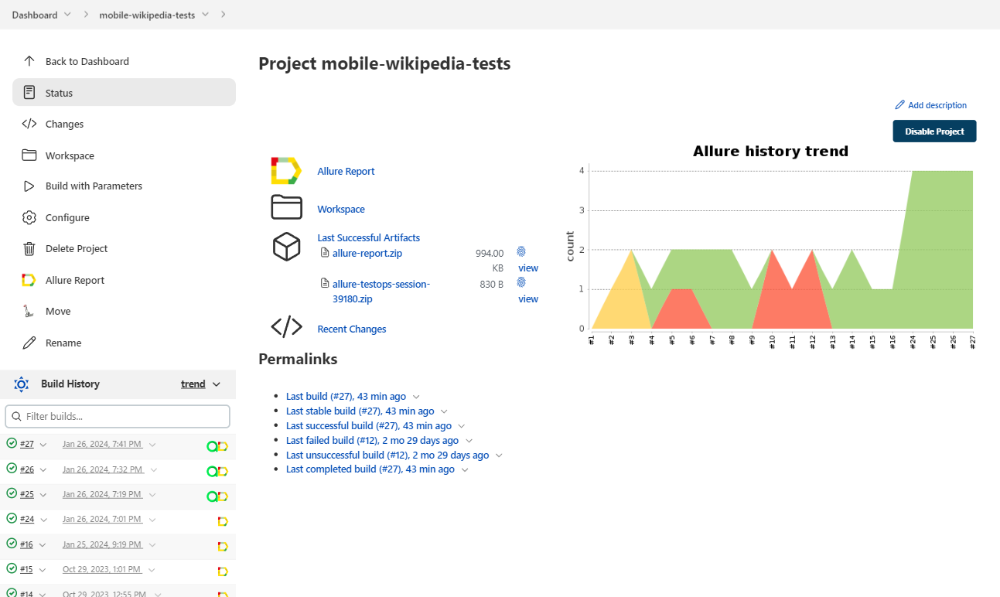

# Test automation project for [Wikipedia](https://ru.wikipedia.org/) mobile app

<p align="center"><a href="https://ru.wikipedia.org/"></a></p>  

## :bookmark_tabs: Contents
- [Technologies and tools](#computer-technologies-and-tools)
- [Test cases](#clipboard-test-cases)
- [Running tests locally](#rocket-running-tests-locally)
- [Build in Jenkins](#-build-in-jenkins)
- [Test results in Allure report](#-test-results-in-allure-report)
- [Test management in Allure TestOps](#-allure-testops)
- [Integration with Jira](#-integration-with-jira)
- [Remote launch in Browserstack](#-remote-launch-in-browserstack)
- [Notification of test results in Telegram](#-notification-of-test-results-in-telegram)
- [Test video](#film_strip-test-video)


## :computer: Technologies and tools
<p align="center">
<a href="https://www.jetbrains.com/idea/"></a>
<a href="https://www.java.com/"></a>
<a href="https://github.com/allure-framework"></a>
<a href="https://qameta.io/"></a>
<a href="https://gradle.org/"></a>
<a href="https://junit.org/junit5/"></a>
<a href="https://github.com/"></a>
<a href="https://www.jenkins.io/"></a>
<a href="https://web.telegram.org/"></a>
<a href="https://www.atlassian.com/software/jira/"></a>
<a href="https://www.browserstack.com/"></a>
<a href="https://appium.io/"></a>
</p>

Automated tests are written in the `Java` language using `JUnit 5` and `Selenide`. The project is built with `Gradle`. For remote execution, a task is implemented in `Jenkins` to generate an `Allure report` and send the results to `Telegram` using a bot. Local execution is done in the `Android Studio` emulator. Remote execution on real mobile devices is carried out on `Browserstack`. `Appium Server GUI` and `Appium Inspector` are used for writing automated tests. To manage test scenarios and manually initiate test runs, `Allure TestOps` is utilized, and the results of their completion are linked to `Jira` issues.

## :clipboard: Test cases
- :white_check_mark: Successful article search
- :white_check_mark: Check main page sections
- :white_check_mark: Hide featured article
- :white_check_mark: Change language

## :rocket: Running tests locally

### Local launch (via emulator)

```bash
gradle clean test -Dhost=local
```

> To run local tests, the following programs are required: Appium, Appium Server, Android Studio

### Remote launch (via browserstack)

```bash
gradle clean test -Dhost=browserstack
```

##  Build in [Jenkins](https://jenkins.autotests.cloud/job/mobile-wikipedia-tests/)
<p align="center">  
</a>  
</p>

##  Test results in [Allure report](https://jenkins.autotests.cloud/job/mobile-wikipedia-tests/allure/)
<p align="center">  
</a>  
</p>
<p align="center">  
</a>  
</p>

##  Test management in [Allure TestOps](https://allure.autotests.cloud/project/4001/dashboards)
<p align="center">  
</a>  
</p>
<p align="center">  
</a>  
</p>

##  Integration with [Jira](https://jira.autotests.cloud/browse/HOMEWORK-1085)
<p align="center">  
</a>  
</p>


##  Notification of test results in [Telegram](https://play.google.com/store/apps/details?id=org.telegram.messenger&hl=ru&gl=US)
<p align="center">  
</a>  
</p>

##  Remote launch in [Browserstack](https://app-automate.browserstack.com/dashboard/v2/builds/100cb76c76a2eb6a330a94f7a6590a887adb5fde/sessions/863b2681e96634f718fa7a3efc990accc8be97a5)
<p align="center">  
</a>  
</p>

## :film_strip: Test video
<p align="center">  
</a>  
</p>
